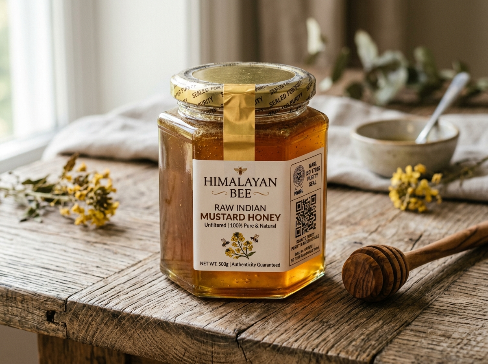
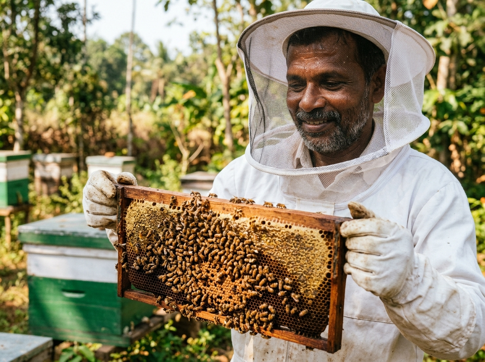
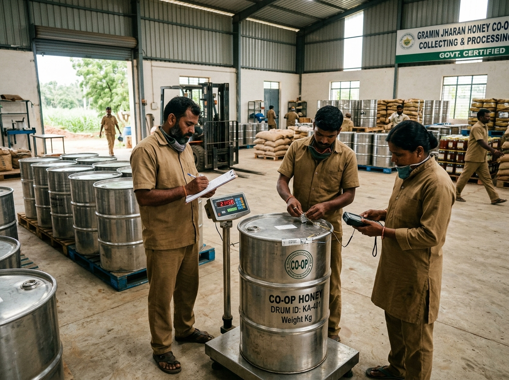

<div align="center">
  

  # 🍯 MadhuMitra & HoneyChain
  
  **Making honey fraud more expensive than the honey itself.**

  [](#)
  [](#)
  [](#)
  [](#)
  [](#)
  [](#)

  *A high-fidelity prototype system built for the Smart India Hackathon (SIH26021) focusing on offline-first apiculture telemetry, computer vision comb analysis, and immutable blockchain traceability.*
</div>

---

## 🐝 The Problem: The Aggregation Black Hole

Indian beekeepers operate in dense mangrove forests and remote mustard fields. When their pure honey is collected by aggregators, it is mixed with cheap ₹40/kg syrup in 200-litre drums. The origin, the effort of the farmer, and the purity are permanently erased.

Existing traceability solutions rely on farmers scanning QR codes or uploading data to the cloud in areas with zero cellular connectivity, making them completely unviable for rural India.

## 💡 The Solution: The Sentinel Model

**MadhuMitra** eliminates manual data entry and cellular dependencies. Instead of equipping every hive with an expensive scale (which would bankrupt farmers), we use a **Sentinel Hive** model. A farmer deploys just 1 IoT scale per 50 hives, acting as a biological proxy to monitor regional nectar flow and daily weight changes.

The hardware signs the proof. The mobile app acts as an offline bridge. The blockchain guarantees the origin.

---

## 📸 System UI Overview

> *Note: Below are the core interfaces of the prototype system.*

### 1. The Beekeeper Field Companion (`/beekeeper`)
Built for field simplicity and offline resilience. Features a true-to-life interactive mobile view.
- **MoGe-3 Comb Scanner**: Uses on-device photogrammetry to estimate honey volume and capping percentage from standard camera frames, ensuring moisture is <20%.
- **Offline Sync**: Connects to the Sentinel Hive via BLE to download telemetry from the LittleFS ring buffer.
- *Insert Screenshot: Beekeeper Dashboard and Comb Scanner.*

<div align="center">
  
  <p><i>The MoGe-3 Comb Scanner running offline.</i></p>
</div>

### 2. The FPO Aggregation Terminal (`/fpo`)
Used by the Farmer Producer Organization to cryptographically bind the farmer's raw harvest data to the physical drums.
- Selects verified harvest candidates from the edge nodes.
- Generates a **HoneyChain Lot** and mints the traceability record to the Polygon network.
- *Insert Screenshot: FPO Lot Creation Modal.*

<div align="center">
  
  <p><i>FPO facility where cryptographic binding occurs.</i></p>
</div>

### 3. The Consumer Traceability Portal (`/trace`)
What the end consumer sees when they scan the QR code on their retail jar.
- Displays the exact apiary origin, the Sentinel Hive telemetry graph, and lab test results (NMR, C4 Sugars).
- Exposes the raw Polygon transaction hash for independent verification.
- *Insert Screenshot: Consumer Traceability App with Blockchain details.*

---

## 🏗️ System Architecture

Our end-to-end architecture is completely decentralized, leveraging edge computing to secure the data before it ever reaches the cloud.

```mermaid
flowchart TD
    %% Custom UI Styling
    classDef hardware fill:#FEF3C7,stroke:#D97706,stroke-width:2px,color:#1C1917
    classDef software fill:#FAF8F5,stroke:#1C1917,stroke-width:2px,color:#1C1917
    classDef blockchain fill:#F3E8FF,stroke:#9333EA,stroke-width:2px,color:#1C1917

    subgraph Phase1["1. At the Farm (Offline Field)"]
        A[Smart Hive Sensors]:::hardware -->|Monitors Environment| B(IoT Microcontroller):::hardware
        B -->|Cryptographically Signs Data| B
        B -->|Stores Safely Offline| B
    end

    subgraph Phase2["2. Honey Harvest"]
        B -.->|Bluetooth Sync| C[Beekeeper Mobile App]:::software
        C -->|AI Honey Comb Scanner| C
    end

    subgraph Phase3["3. Co-op Processing"]
        C == Uploads when online ==>> D[Aggregation Dashboard]:::software
        D -->|Validates Field Signatures| D
        D -->|Packages into Batches| E[Final Honey Lot]:::software
    end

    subgraph Phase4["4. Immutable Trust"]
        E == Registers Lot ==>> F[(Blockchain Registry)]:::blockchain
    end

    subgraph Phase5["5. The Consumer"]
        H[Scans Retail QR Code]:::hardware -.-> G
        F == Fetches History ==>> G[Traceability App]:::software
        G -->|Shows Farm Origin & Lab Tests| I((Verified Customer))
    end
```

---

## 🛠️ Technology Stack

This repository contains the high-fidelity **Frontend UI Prototype** simulating the entire system flow for demonstration purposes.

### Frontend (This Repository)
- **Framework**: React 18 + Vite
- **Styling**: Tailwind CSS (Brutalist-lite design, hard shadows, high contrast)
- **Icons**: Lucide React
- **Data Visualization**: Recharts (for Hive telemetry graphs)
- **Routing**: React Router DOM

### Simulated Hardware / Backend
*The UI is built to accurately represent the following backend/hardware stack:*
- **Microcontroller**: ESP32-S3 Dual-Core LX7
- **Sensors**: HX711 (Load Cell), BME280 (Temp/Humidity)
- **Security**: Hardware-level secp256k1 ECDSA cryptographic signing
- **Storage**: LittleFS (offline flash memory buffer)
- **Blockchain**: Polygon (EVM compatible)

---

## 🚀 Getting Started (Run the Prototype)

To run this high-fidelity UI prototype locally:

1. **Clone the repository**
   ```bash
   git clone https://github.com/your-org/madhumitra-ui.git
   cd madhumitra-ui
   ```

2. **Install dependencies**
   ```bash
   pnpm install
   # or npm install / yarn install
   ```

3. **Start the development server**
   ```bash
   pnpm dev
   ```

4. **Explore the Demo Flows**:
   - `/` - Main Landing Page & System Overview
   - `/beekeeper` - Beekeeper Field Companion App
   - `/fpo` - FPO Aggregation Terminal
   - `/trace` - Consumer Traceability App

## 📚 Research & References

The HoneyChain architecture is directly backed by the following peer-reviewed academic research:

1. **Runzel, M. A. S. et al.**, "Designing a Smart Honey Supply Chain for Sustainable Development," *IEEE Consumer Electronics Magazine*, Vol. 10(4), 2021. DOI: [10.1109/MCE.2021.3059955](https://doi.org/10.1109/MCE.2021.3059955)
2. **Edwards-Murphy, F. et al.**, "b+WSN: Smart beehive with preliminary decision tree analysis for agriculture and honey bee health monitoring," *Computers and Electronics in Agriculture*, Vol. 130, 2016. DOI: [10.1016/j.compag.2016.04.008](https://doi.org/10.1016/j.compag.2016.04.008)
3. **Kamilaris, A. et al.**, "The rise of blockchain technology in agriculture and food supply chains," *Trends in Food Science & Technology*, 91, 2019. DOI: [10.1016/j.tifs.2019.07.034](https://doi.org/10.1016/j.tifs.2019.07.034)
4. **Malik, S. et al.**, "TrustChain: Trust Management in Blockchain and IoT Supported Supply Chains," *Proc. of the 2019 IEEE International Conference on Blockchain*, 2019. DOI: [10.1109/Blockchain.2019.00032](https://doi.org/10.1109/Blockchain.2019.00032)
5. **Almiani, K. et al.**, "Fujairah Honey Chain (FHC): A Blockchain Framework for Monitoring Honey Production," *Information*, 16(8), 2025. DOI: [10.3390/info16080626](https://doi.org/10.3390/info16080626)

---

<div align="center">
  <p><b>Built with ❤️ by Team Persistence</b></p>
  <p><i>Empowering rural beekeepers with trustless, offline-first technology.</i></p>
</div>
